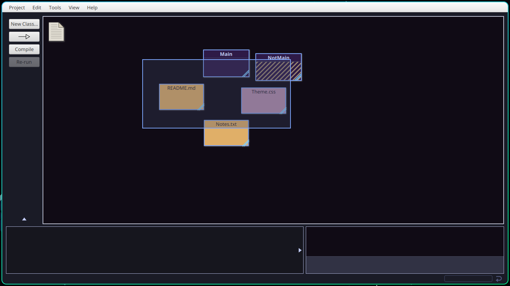

# 🎨 BlueJ AuraPulse

A complete, modern dark theme for the BlueJ Java IDE.

```Why? I made this```
**Was Tired of BlueJ feeling so old-school duh!! Meh! So I made this theme for my own sanity~** 

## It features remakes of popular themes like **Tokyo Night**, **Catppuccin**, and **Ocean Space**, mixed with some of my **own custom CSS colors**.

And, Yeah in case **_you care_**
 It's **designed** for readability, usability, and aesthetics—making coding more enjoyable and less _straining on your eyes_.

---

## ✨ Gallery

>Before you dive in for eye candy all of this pics are 720p, and might look better or worse depending on your resolution!

**NOTE - windows navigation buttons are not overwirtten via CSS, its Just hyprland thingy here will look normal in Windows, Macos and other Desktop environment** 
## **It's all FiraCode Nerd fonts**
### Editor Window


### Project View


### Selection


### Preferences


### Project Menu


### Class Menu


### Dialogue Windows


### Method Calling


### Terminal

>**The Whiteness that you see here which is left over In terminal!~ Yeah I tried, its hardcoded!**
### Terminal Runing


---


## 🛠️ Installation

1. **Download the theme**
   Click the green **Code** button on this page → **Download ZIP**.

2. **Locate BlueJ's stylesheet folder**
   - **Windows:** `C:\Program Files\BlueJ\lib\stylesheets`
   - **macOS:** Right-click BlueJ → **Show Package Contents** → `Contents/Resources/Java/stylesheets`
   
   >Tbh, Not sure for macOS, Please let me
   - **Linux:** Usually `/usr/share/bluej/lib/stylesheets`

3. **Replace the files**
   - Extract the ZIP.
   - Copy all `.css` files into the `stylesheets` folder.
   - *(Optional but recommended: back up the originals first!)*

4. **Restart BlueJ**
   The dark theme will now be applied.

---

## Uninstall / Revert

- Replace the modified `.css` files with your backups, **or**
- Reinstall BlueJ to restore the default styles.

---

## Customization

- Edit `java-colors.css` to tweak editor and codepad colors (e.g., background and cursor visibility). 
- If you want like a Underline cursor. here you go! this will go inside `flow.css`
```
/* --- For Underline ---*/
 .flow-caret {
    -fx-stroke-width: 16px; 
    -fx-stroke-line-cap: butt;
    -fx-stroke: linear-gradient(
        to bottom, 
        rgba(0,0,0,0) 0%, 
        rgba(0,0,0,0) 92%, 
        #F7AFFF 90%,   
        #F7AFFF 100%   
    );
  -fx-effect: dropshadow(three-pass-box, rgba(203, 166, 247, 0.7), 12, 0.3, 0, 0);
}

``` 
>Play with it, I mean its just a Css trick BlueJ doesn't have a Underline Cursor


---

## 🤝 Contributing

Contributions and tips are welcome!
- Open an **Issue** for bugs or ideas.
- Submit a **Pull Request** for improvements (CSS tweaks, terminal colors, docs, etc.).

---

## ❤️ Acknowledgements

- Thanks to [Vickwes](https://github.com/Vickwes/BlueJ-Dark-Mode) — his configs were a great help.
- Thanks to [WickedKakashi](https://github.com/WickedKakashi) — a silent helper and the core reason for these matching palettes.
- Inspired by the **Tokyo Night**, **Catppuccin** and **Ocean Space** palettes.

## License
<sub> MIT License — Copyright (c) 2026 **Aayan~** </sub>

---
<div align="center">

### 🎔 Made with love by [OpalAayan](mailto:YougurtMyFace@proton.me)

## Star History

[](https://www.star-history.com/?repos=OpalAayan%2FBlueJ-AuraPulse&type=date&legend=top-left)

<p align="center"></p>

</div>
